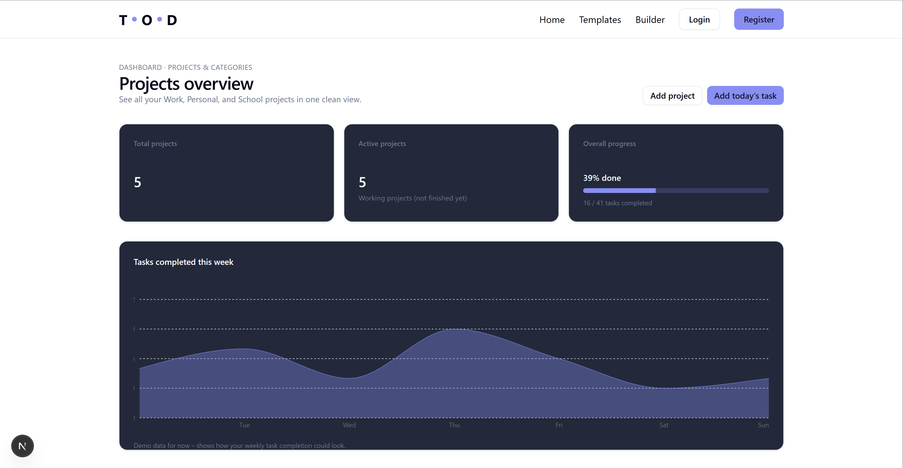
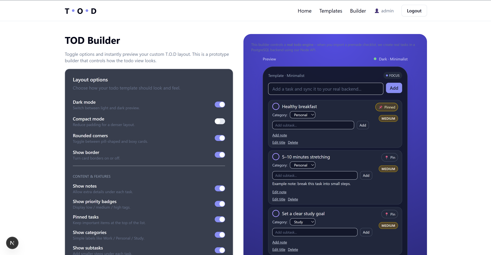
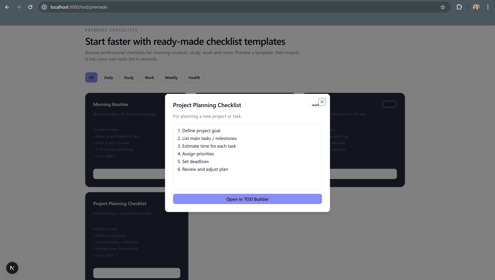
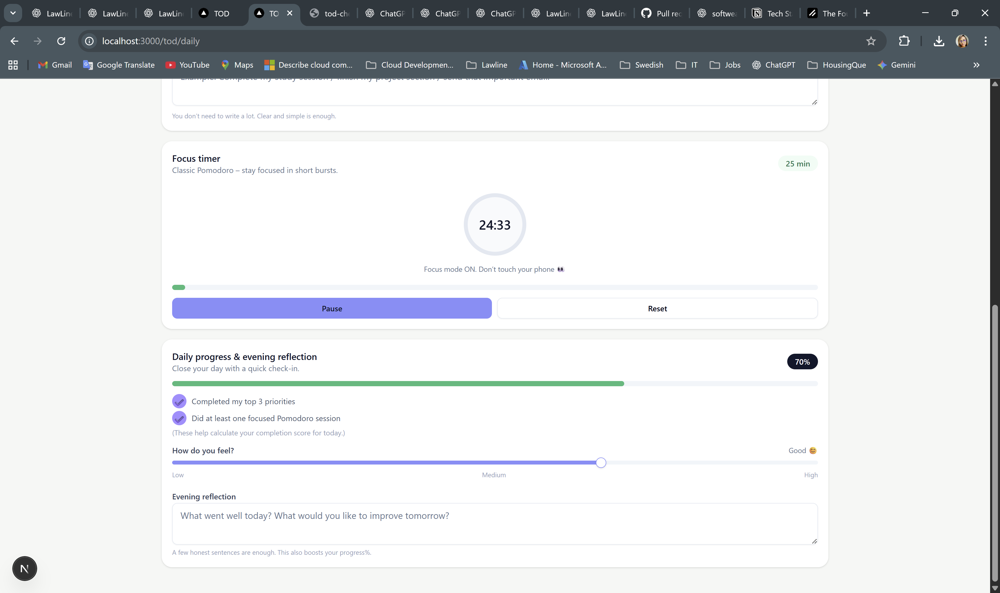
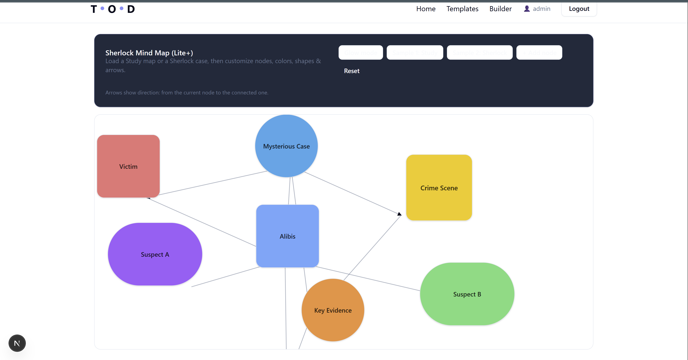

# TOD — Todo On Demand

A modern task-management application built with Next.js, React, and TypeScript.

[🌐 Live Demo](https://apps-web-psi.vercel.app/)  
[📦 GitHub Repository](https://github.com/RMSSanali/apps-web)

---

## ✨ About the Project

TOD — Todo On Demand is a productivity-focused web application designed to help users organise tasks, create checklists, manage projects, and explore different planning methods.

The application includes multiple interfaces for different workflows, including minimal task lists, daily planning, premade checklists, project organisation, and mind-map creation.

---

## 🌟 Main Features

- Create and manage todo items
- Mark tasks as completed
- Organise tasks by priority and project
- Premade checklist templates
- Emoji-based checklists
- Daily planner
- Minimal todo layout
- Dark mode interface
- Project dashboard
- Mind-map creator
- PDF export support
- English and Swedish language support
- Responsive design

---

## ⚙️ Installation

### Requirements

- Node.js 20 or later
- npm

### Setup

```bash
git clone https://github.com/RMSSanali/apps-web.git
cd apps-web
npm install
npm run dev
```

Open the application at:

```text
http://localhost:3000
```

### Available Commands

```bash
npm run dev      # Start the development server
npm run lint     # Run ESLint
npm run build    # Create a production build
npm start        # Start the production server
```

---

## 🔧 Environment Variables

No environment variables are required to run the current frontend locally.

The project includes a local `.env.local` file for optional development configuration. This file is ignored by Git and must not contain committed passwords, API keys, or other private credentials.

If environment variables are added in the future, document their names and example values here without including real secrets.

---

## 📁 Folder Structure

```text
app/              Next.js routes and page layouts
components/       Reusable UI and todo components
data/             Checklist templates and sample data
i18n/             Internationalisation configuration
lib/              Authentication, PDF export, and utilities
messages/         English and Swedish translations
public/tod/       Screenshots and demo assets
store/            Zustand state stores
```

---

## 🛠️ Tech Stack

- Next.js 16
- React 19
- TypeScript
- Tailwind CSS
- Radix UI
- Lucide React
- Framer Motion
- Zustand
- Recharts
- jsPDF
- next-intl
- Vercel

---

## 🎥 Built-in Tutorial and Planning Experiences

The project includes guided productivity and planning experiences that demonstrate how users can work with:

- Todo lists
- Daily planning
- Checklist templates
- Project organisation
- Mind-map planning
- Different productivity layouts

---

## 🎨 UI Polish Mode

The interface focuses on:

- Clear visual hierarchy
- Responsive layouts
- Reusable UI components
- Consistent spacing and typography
- Light and dark themes
- Accessible controls
- Interactive animations

---

## 🧭 Global Navigation

The application includes navigation for the main areas of the project, including:

- Home
- Todo views
- Templates
- Projects
- Builder
- Mind-map tools
- Authentication pages

---

## 🔐 Authentication System

The project includes a frontend authentication demonstration with login and registration interfaces.

The current authentication flow is intended for frontend demonstration. Production authentication would require a secure backend, database, server-side sessions, password hashing, and protected API routes.

---

## 📝 Minimal Todo App

The minimal todo view provides a focused interface for:

- Adding tasks
- Completing tasks
- Reviewing task progress
- Keeping the interface simple and distraction-free

---

## 🧠 Mind-map Creator

The mind-map view helps users organise ideas visually by connecting related concepts and planning tasks around a central topic.

---

## 🎨 Screenshots

### Todo Dashboard



### Todo Builder



### Premade Checklists



### Daily Planner



### Mind-map Creator



---

## 🎥 Application Demo

Watch the application walkthrough:

[▶️ View the TOD demo video](public/tod/videos/tod-demo.mp4)

---

## 🧪 Testing and QA

The application was manually tested during development to verify the main user flows and interface behaviour.

### Manual Test Coverage

| ID | Test Case | Expected Result |
|---|---|---|
| TC-001 | Open the application | The home page loads successfully |
| TC-002 | Add a todo item | The todo appears in the task list |
| TC-003 | Complete a todo item | The task changes to a completed state |
| TC-004 | Open the Todo Builder | The builder page loads correctly |
| TC-005 | Open a checklist template | The selected template displays correctly |
| TC-006 | Navigate between pages | Navigation links open the correct pages |
| TC-007 | Switch between light and dark themes | The visual theme changes correctly |
| TC-008 | Change the application language | Supported text changes correctly |
| TC-009 | Open the mind-map view | The mind-map interface loads correctly |
| TC-010 | Use PDF export | A PDF file is generated |
| TC-011 | Open the Vercel deployment | The production application loads successfully |
| TC-012 | Test a smaller screen size | The layout remains usable and responsive |

The project currently uses manual testing. Automated unit, integration, and end-to-end tests may be added in future development.

---

## 📦 Deployment

The application is deployed with Vercel:

[Open the live application](https://apps-web-psi.vercel.app/)

---

## ⚠️ Current Limitations

This repository focuses mainly on the frontend experience.

Some task-management flows reference a local backend at:

```text
http://localhost:4000
```

The backend is not included in this repository.

The current authentication flow is a frontend demonstration and should not be used as production authentication without a secure backend implementation.

---

## 🤝 Contributing

This project is personal portfolio work. Suggestions and improvements are welcome through pull requests.

---

## 📜 License

This project is available for educational and portfolio purposes.

---

## ❤️ Author

Created by [RMSSanali](https://github.com/RMSSanali).
